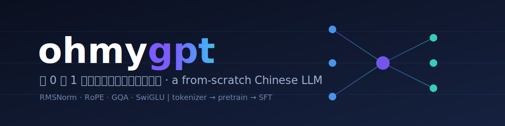

<p align="center">
  
</p>

<p align="center"><b>中文</b> · <a href="README_EN.md">English</a></p>

# ohmygpt

> 从 0 到 1 手写一个中文小型大语言模型 —— minimind 风格的教学项目。
> A small Chinese LLM built **from scratch**, for learning how modern LLMs actually work.

`tokenizer → pretrain → SFT`，每个核心机制都手写实现、可读可改，只在「无聊的管道」（数据加载、BPE 训练）上依赖现成库。

## About

ohmygpt 的目标是**学习 LLM 内部原理**，而不是追求 SOTA 性能。它复刻了现代解码器（Llama / Qwen 同款组件）的关键设计，并提供完整但精简的训练管线，可在一张 **RTX 3060 (12GB)** 上从零训练出一个能补全中文、能简单对话的小模型。

代码刻意保持轻量与透明：

- **无重型框架**：不用 accelerate / deepspeed，训练循环自己写，每一步都看得见。
- **现代架构，全部手写**：RMSNorm、RoPE 旋转位置编码、分组查询注意力（GQA）、SwiGLU 前馈、权重共享（tied embeddings）。
- **完整管线**：训练分词器 → 预训练基座模型 → 指令微调（SFT，带 prompt 损失掩码）→ 推理（top-p 采样 + 多轮对话）。
- **正确性优先**：含 overfit-one-batch 等单元测试，作为「架构是否接对」的关键信号。

设计与实现计划见 [`docs/superpowers/`](docs/superpowers/)。灵感来自 [jingyaogong/minimind](https://github.com/jingyaogong/minimind)。

## Features

| 模块 | 文件 | 说明 |
|------|------|------|
| 模型 | `model/config.py`, `model/model.py` | 解码器：RMSNorm · RoPE · GQA · SwiGLU · 权重共享 |
| 分词器 | `train/train_tokenizer.py` | byte-level BPE，词表 6400，特殊符 `<unk>/<s>/</s>` + 对话模板 |
| 数据集 | `dataset.py` | `PretrainDataset`（打包定长窗口）+ `SFTDataset`（对话模板 + 仅对答案计损失） |
| 训练 | `train/pretrain.py`, `train/sft.py` | AdamW、cosine 调度 + warmup、bf16/fp16 混合精度、梯度累积、梯度裁剪 |
| 推理 | `inference.py` | top-p（nucleus）采样，KV-cache 加速，支持补全（complete）与对话（chat）两种模式 |
| 测试 | `tests/` | RMSNorm/RoPE/注意力/前馈/整模型单测 + overfit 校验 + 分词器往返 + 损失掩码 + 缓存生成一致性测试 |

## Model presets

两套配置，先用 `small` 快速跑通管线，再用 `base` 正式训练。

| 参数 | `small`（≈6M） | `base`（≈26M） |
|------|---------------|----------------|
| dim（隐藏维度） | 256 | 512 |
| n_layers | 4 | 8 |
| n_heads | 8 | 16 |
| n_kv_heads（GQA） | 4 | 8 |
| max_seq_len | 512 | 512 |
| vocab_size | 6400 | 6400 |

## Project layout

```
ohmygpt/
├── model/
│   ├── config.py          # ModelConfig 数据类 + small/base 预设
│   ├── model.py           # Transformer：RMSNorm, RoPE, GQA, SwiGLU
│   └── tokenizer/         # 训练好的 BPE 分词器文件
├── dataset.py             # PretrainDataset / SFTDataset + 加载器
├── train/
│   ├── train_tokenizer.py # 训练 BPE 分词器
│   ├── pretrain.py        # 预训练循环
│   └── sft.py             # 指令微调循环
├── inference.py           # 加载 checkpoint，采样 / 对话
├── tests/                 # 单元与正确性测试
├── data/                  # minimind 数据集（已 gitignore）
└── docs/superpowers/      # 设计文档与实现计划
```

## Setup

```bash
python -m venv .venv && source .venv/bin/activate
pip install -r requirements.txt
```

> 训练需要 NVIDIA GPU（推荐 RTX 3060 12GB 或更高）。CPU/MPS 可运行单元测试，但不适合实际训练。

## Pipeline

1. 下载 minimind 数据集到 `data/`（来自 HuggingFace `jingyaogong/minimind_dataset`）：
   ```bash
   python scripts/download_data.py            # 国内慢/被墙可加：--endpoint https://hf-mirror.com
   ```
2. 训练分词器：`python train/train_tokenizer.py`
3. 预训练：`python train/pretrain.py --preset base`
4. 指令微调：`python train/sft.py --preset base`
5. 对话：`python inference.py --ckpt checkpoints/sft.pt --mode chat --prompt "你好"`

**建议先用 `--preset small` 端到端跑通一遍**，确认管线无误后再上 `base`：

```bash
python train/pretrain.py --preset small --limit 2000 --batch_size 4 --accum_steps 2
```

显存不够时，调小 `--batch_size` 并调大 `--accum_steps`，保持有效 batch 不变。

## Sanity checks

训练前务必先跑这两个检查，它们能在浪费 GPU 时间前抓出接线错误：

- `pytest tests/test_model.py::test_overfit_single_batch` —— 单批过拟合，loss 必须降到 0.1 以下。
- `pytest tests/test_generate.py` —— KV-cache 生成结果须与朴素全量重算一致。
- `pytest tests/test_tokenizer.py` —— 分词器编解码往返一致。

完整测试：`pytest -v`。

## Acknowledgements

- 灵感与数据集来自 [jingyaogong/minimind](https://github.com/jingyaogong/minimind)。
- 架构参考 Llama / Qwen 系列的现代解码器设计。
